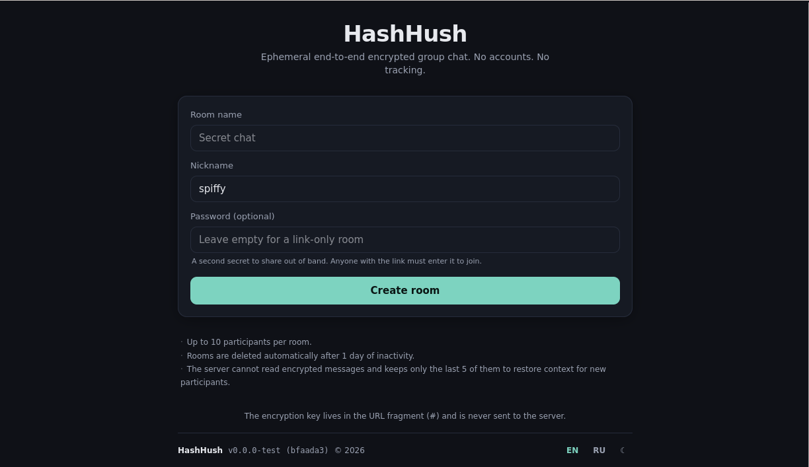
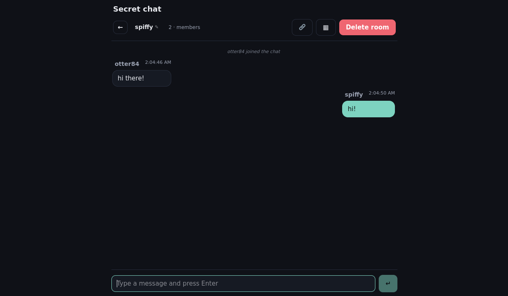

*[Читать на русском](README_ru.md)*

# HashHush

An ephemeral end-to-end encrypted group chat that runs from **a single self-contained C++ binary with the entire frontend embedded inside it** — no separate web root, no external static-file server, no extra runtime. Rooms exist only as long as they are used; the server cannot read message contents, never sees the encryption key, and stores no persistent transcript.

The project is a different take on the same idea behind [niltalk](https://github.com/knadh/niltalk): unauthenticated, link-shared chat rooms with no account system. HashHush trades niltalk's session-cookie model for client-side end-to-end encryption, fragment-only key delivery, and a stable per-room identity derived from the access token, so privacy holds even against a fully compromised server.

## Screenshots

| Home | Chat |
|------|------|
|  |  |

## Features

- **End-to-end encryption** with XChaCha20-Poly1305 (libsodium, in WebAssembly). The server only ever sees ciphertext.
- **Encryption key never reaches the server.** The eight-character key seed lives in the URL fragment (`#`), which browsers do not transmit. The server only sees the bare `/` path on page load.
- **Optional password.** A second secret, agreed out of band, can be required to join. The link alone is then insufficient — useful when the link travels through a less trusted channel than the password.
- **Enumeration-resistant join.** "Room missing", "wrong key" and "wrong password" all produce the same WebSocket-level response, so an attacker cannot probe random room ids to discover which ones exist.
- **Ephemeral rooms.** Rooms self-destruct on inactivity (default 24 hours since the last message) or when any participant deletes the room.
- **No accounts.** A nickname is an optional label. Each participant has a stable in-room id derived from their access token, so identity survives reloads without persisting anything sensitive.
- **One-time challenge pool** for first-time joiners. The room creator submits `(5 or 10) * max_participants` `(plaintext, ciphertext, nonce)` triples encrypted under the room key — `×10` when a password is required, `×5` otherwise. A new joiner has to decrypt one to be admitted; once consumed, a triple cannot be reused.
- **Persistent access tokens and cached keys.** After a successful first join, the server issues a token and the client stores both the token and the validated key in `localStorage`. The password is wiped from memory the moment the key is derived, so reloads do not require re-entry.
- **QR sharing.** A modal renders a QR of the invite link locally, no third-party request.
- **Single-binary deployment.** The Svelte 5 frontend is bundled into one HTML file and embedded directly into the C++ executable.
- **No HTTPS dependency.** All cryptography is performed locally in the browser via libsodium; the application works correctly over plain `http://`.

## How it works

### URL scheme

```
https://host/#<roomId>:<seed>
```

The path is always `/`. Both the room id and the key seed live in the URL fragment. The fragment is processed entirely by the browser; the server never receives it on the initial page load. Subsequent API calls do carry the room id over the wire, but never the seed.

### Room creation

1. `POST /api/rooms { name, requires_password }` creates an inactive room and returns `{ room_id, max_participants, challenges_required }`. `challenges_required` is `5 * max_participants` for a link-only room and `10 * max_participants` when a password is set.
2. The client generates a random eight-character seed, derives the symmetric key from `(seed, password)` (see *Key derivation*) and produces `challenges_required` triples of the form `{ plaintext, ciphertext, nonce }`, where `ciphertext = AEAD_encrypt(key, nonce, plaintext)` and `plaintext` is 32 random bytes.
3. `POST /api/rooms/{id}/activate { challenges }` uploads the triples. The server only stores the base64 blobs — it cannot decrypt any of them and never learns the seed or the password.
4. The room becomes active. The browser's address bar is rewritten to `/#<roomId>:<seed>` so a reload re-derives the key locally. The password, if any, is stored only as a cached key in `localStorage`; it is never transmitted and is wiped from JS memory after derivation.

### Joining

A WebSocket is opened to `/ws?room=<id>` (optionally `&token=<t>` for a returning peer). The upgrade succeeds for any non-empty room id — even one that does not exist on the server — so that probing random ids cannot be used to enumerate live rooms.

- **Returning peer with a stored token** sends `{ type: "hello", token }`. The server validates the token and replies with `{ type: "joined", peer_id, room_name, members, history }`. Any failure (token mismatch, room missing) closes the socket with the generic `invalid_key` code.
- **First-time peer** sends `{ type: "hello" }`. The server replies with `{ type: "challenge", ciphertext, nonce }` — a real one if the room exists and has spare challenges, a random decoy otherwise. The client decrypts and answers `{ type: "challenge_response", plaintext }`. On a match, the server issues a fresh access token and finalises the join; on any mismatch it closes with `invalid_key`.
- **Wrong password** is the same wire response as "wrong key" — the client distinguishes the two locally and prompts the user to retype the password.

The peer id is the first 16 hex characters of `SHA-256(token)` — deterministic from the token, so the same browser tab gets the same id across reloads. Cached message history is annotated with the original sender's peer id, which lets a reconnected client recognise its own previous messages without involving the server.

If the room's challenge pool is exhausted (a hard cap of `5 *` or `10 * max_participants` total challenge-flow joins over its lifetime), the server returns the same decoy-challenge path, so the user sees a `wrong_password`-like result.

### Message flow

- Outgoing chat: `{ type: "msg", payload }` where `payload = base64(nonce || ciphertext)` produced from a JSON object `{ kind: "chat", text, nick }`.
- Outgoing presence (nickname announcement): `{ type: "presence", payload }` for `{ kind: "presence", nick }`.
- The server **caches** only `msg` frames into a per-room ring buffer (default 5 entries). Presence frames are relayed but never persisted, so they cannot evict real messages from the buffer.
- The server broadcasts the frame back to every joined peer. New joiners replay the cache once on `joined`.

### Key derivation

Four SHA-256 rounds with literal salts, each concatenated as raw bytes with the previous round's output. The fourth round folds in the optional password — the empty string when no password is set, so the chain has a single fixed shape:

```
k₀ = SHA-256("hash"       ‖ seed_utf8)
k₁ = SHA-256("hush"       ‖ k₀)
k₂ = SHA-256("chat"       ‖ k₁)
k₃ = SHA-256(password_utf8 ‖ k₂)   // 32 bytes — XChaCha20-Poly1305 key
```

A wrong password produces a wrong key; the resulting challenge response does not match, the server closes the connection with `invalid_key`, and the client prompts the user to try again.

### What the server stores

| Storage      | Contents                                                     | Purpose                                                                  |
|--------------|--------------------------------------------------------------|--------------------------------------------------------------------------|
| SQLite (disk)| `rooms`, `challenges`, `access_tokens`                       | Survives restart. None of it lets the server decrypt messages.           |
| RAM          | Live WebSocket peers and the per-room ring buffer of N messages | Lost on restart, which is acceptable: clients reconnect via stored token.|

The server never holds a transcript, never sees plaintext, never sees the seed or the derived key. A full disk dump of the SQLite file gives the attacker challenge ciphertexts and access tokens — useful for impersonating a peer at the WebSocket level (which still cannot read messages without the key) and nothing more.

## Building

### Backend only

Requires a C++20 compiler, CMake 3.16 or later, and the system SQLite library (`libsqlite3-dev` on Debian/Ubuntu). The frontend bundle must be built first (see below).

```sh
cmake -B build
cmake --build build
```

### Full build (frontend and backend)

Requires Node.js 18 or later and npm in addition to the C++ toolchain.

```sh
# 1. Build the frontend.
cd web
npm install
npm run build       # produces web/dist/index.html (single-file SPA)
./embed.sh          # writes src/generated_index_html.h
cd ..

# 2. Build the backend with the embedded frontend.
cmake -B build
cmake --build build
```

The resulting executable serves the SPA at `/`, REST endpoints under `/api/`, and the WebSocket at `/ws`. No external static file server is needed.

### Versioning

The version string is taken from `git describe --tags --dirty` at configure time, with a leading `v` stripped. Without any tags it falls back to `dev`. The same value is generated into `src/version.h` for the binary and into `web/src/version.js` for the frontend bundle, so the footer and the startup log line always agree.

## Running

```sh
# Show help.
./build/src/hashhush --help

# Generate a default config.
./build/src/hashhush --generate-config ./config.ini

# Start the server.
./build/src/hashhush --config ./config.ini
```

### Configuration

See [`contrib/config.ini.example`](contrib/config.ini.example) for the full list. Notable keys:

- **`[server] app_name`** — brand shown on the home page heading. The footer link text is the constant `HashHush`.
- **`[storage] db_path`** — SQLite file location.
- **`[room] default_max_participants`** — capacity per room (default 10). The challenge pool size is `5 * max_participants`.
- **`[room] idle_ttl_seconds`** — how long since the last activity before a room is purged (default 86400).
- **`[room] message_cache_size`** — size of the per-room replay buffer (default 5).
- **`[room] ws_max_payload_bytes`** — maximum WebSocket payload size after base64 encoding.

## Threat model

HashHush protects message **confidentiality and integrity** against:

- A passive observer of HTTP/WS traffic without TLS.
- A fully compromised server operator with full disk and RAM access.
- Other participants of an unrelated room on the same instance.

It does **not** protect against:

- An attacker with the URL fragment (`#<roomId>:<seed>`) **and** the room password (if one was set). Anyone holding both factors is a participant.
- A malicious participant of the same room — they have the key by definition.
- An on-path attacker without TLS who can intercept WebSocket frames in real time. By relaying the legitimate user's `challenge_response.plaintext` to the server faster than the user does, they win the race for that challenge and receive a valid access token. The attacker still holds no key, so they cannot read live or cached messages — but they occupy a participant slot, are visible in the member list, can flood the channel with undecryptable garbage, and (since their access token is valid) can call `DELETE /api/rooms/{id}` to destroy the room. TLS in front of HashHush mitigates this entirely.

## License

[GPL-3.0-or-later](LICENSE)

Author: Roman Lyubimov.

## Acknowledgements

[niltalk](https://github.com/knadh/niltalk) seeded the idea of disposable, account-less, link-shared chat rooms. HashHush takes that premise and rebuilds it with strict end-to-end encryption, fragment-delivered keys and minimal server-side knowledge, so that privacy survives even when the server does not.
